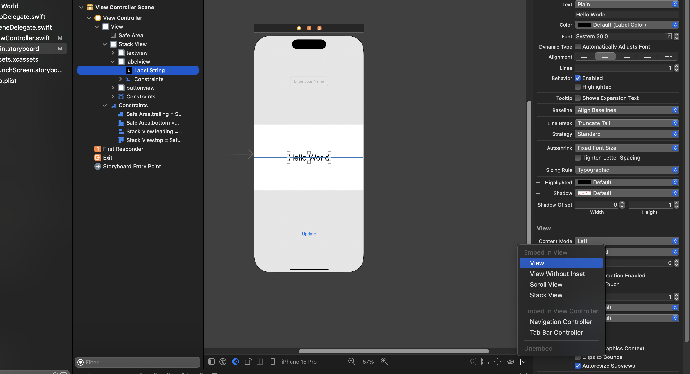
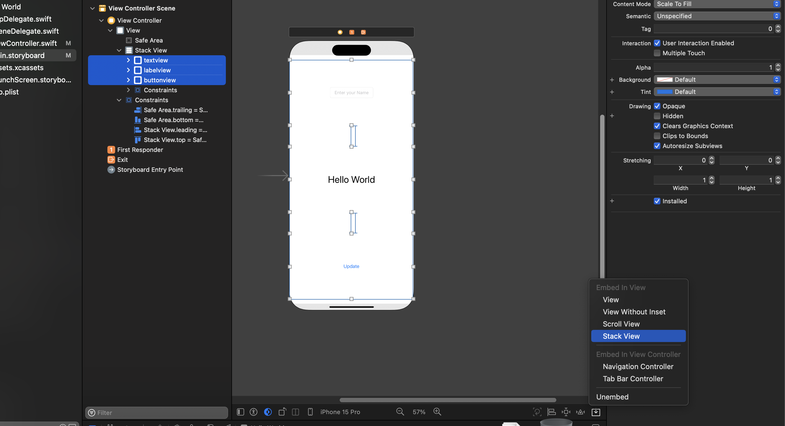
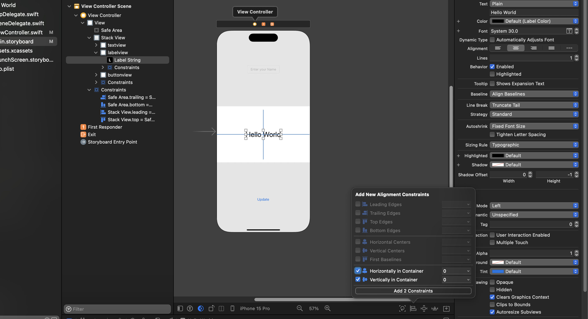
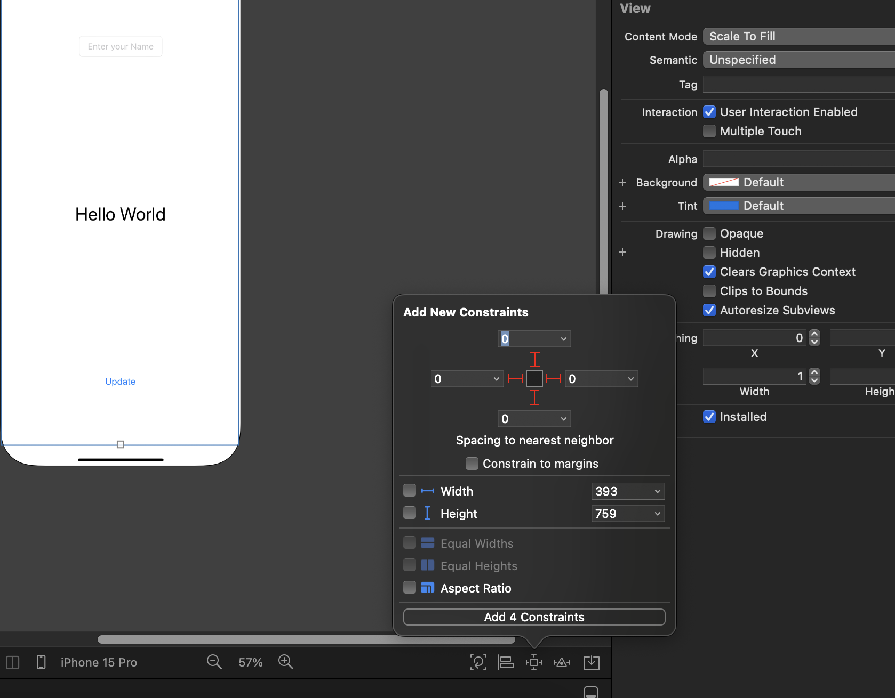
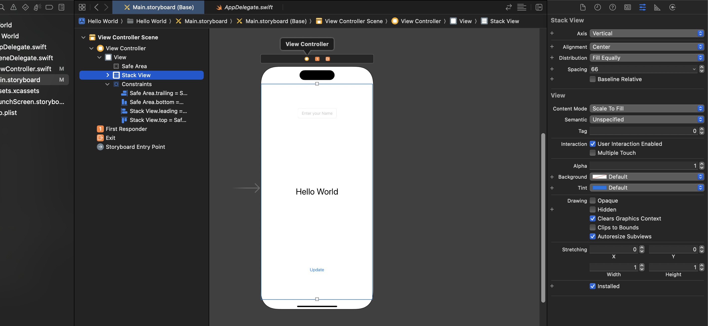
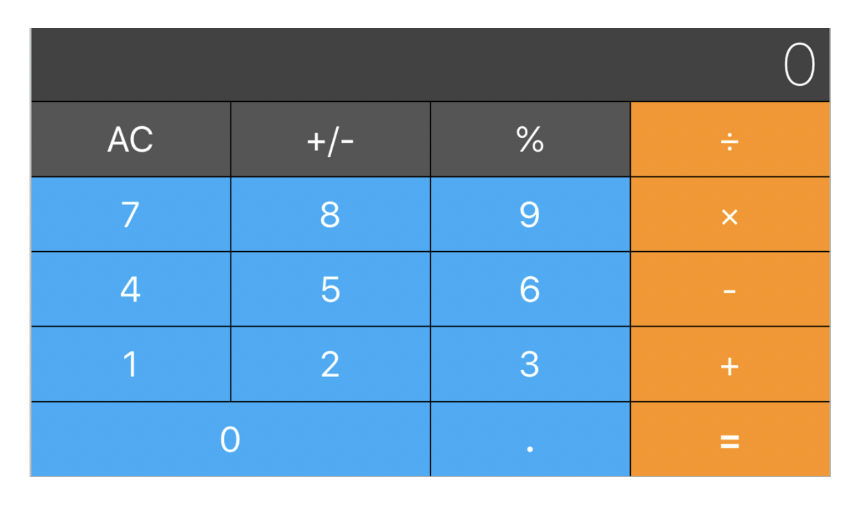

### Auto Layout

---

Auto Layout is used to automatically format layout of our application, and handle screen orientation.

## Size Classes and Orientation

Size classes and device orientation are important concepts in iOS development, particularly when working with Auto Layout to create adaptive user interfaces that look good on various screen sizes and orientations.

### Size Classes

> Size classes are a way of categorizing different screen sizes into compact and regular variations for both width and height.

We use UIView to create containers for our sub views. it will help us algin elements so the application knows how to responsd to screen orientation changes.

There are 3 ways to embed your elements in the container (UIView)
1. Drage and drop the UIView from the wizard
2. Select all the elements you want to embed and follow these steps
   1. Editor -> Embed In -> View
3. Select all the elements you want to embed and follow these steps
   1. Bottom right corner of the StoryBoard Screen (You will find a arrow down, inside a box)-> View

See the picture below.

## AutoLayout Step By Step

1. Embed all your UIElements in their own `view`.

1. Once you embed all your elements, in a view, give a name to the view. Do it for all the views. *You can change the background of your view to adjust the size of the views.*
2. Select all your Views, and Embed them in a Stack view.

3. Select each view and align them and set constraints if you require. Ideally it should be center both **horizontally** and **vertically**.
 
1. Then select the stack view, add  the constrains as 0,0,0,0 *(top, bottom, left, right)*

6. Look into any changes required, if so delete all the constrains and redo all the steps.
7. Your Attributes for the stack view should look like this. 

## Challenge

- If you have completed the Auto Layout Step by Step try completing this UI, for LandScape and Portait Mode.

**Landscape**

**Potrait**

