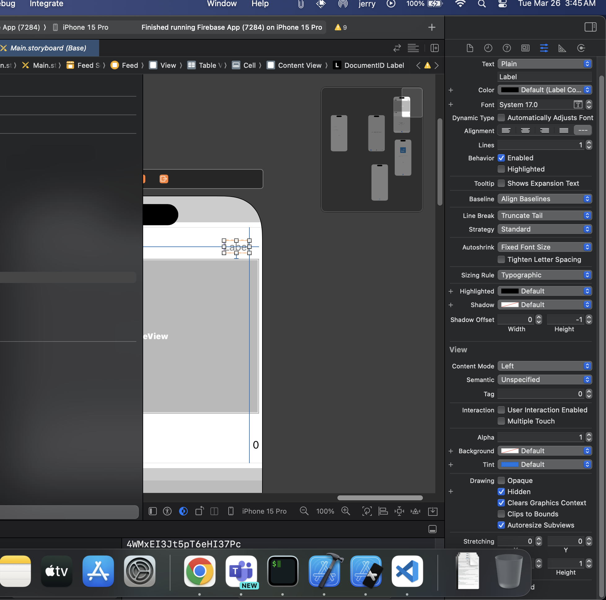

# Final touches for the Firebase App

Once you have finished [Step 3](./GetFirebaseData.md), follow the steps for the final touches for the application.

We will fix up a few issues with the application, as well as complete the remaining functionality.


## Final Touches

1. As of now if you have completed the [Step 3](./GetFirebaseData.md), you might notice that the table view will have duplicate records. 
> This happens because when there is a data change in firebase, the table view just add the new data to the list. we will change this. When there is a new data, we will clear the entrie table view and recreate again.

```swift

// inside this function. 
func getDataFromFirestore( ){
        let firestoreDatabase = Firestore.firestore()
    
        
        firestoreDatabase.collection("Posts")
            .order(by: "date", descending: true) // order data based on date.
            .addSnapshotListener( {
            ( snapshot, error) in
            if error != nil {
                print(error?.localizedDescription ?? "Something went Wrong.")
            }else{
                // We have some data in it.
                if  snapshot?.isEmpty != true && snapshot != nil {
                    
                    // to fix duplicating issue, we remove all the items from the table view
                    // recreate them again.
                    
                    self.userImageArray.removeAll(keepingCapacity: false)
                    self.userEmailArray.removeAll(keepingCapacity: false)
                    self.userCommentArray.removeAll(keepingCapacity: false)
                    self.likeArray.removeAll(keepingCapacity: false)

                    // The above 4 lines will make sure that the table is recreated everytime there is a change in data.

                    // Remaining code.
                }
            }
        })
    }

```

2. Adding the like Functionality

To add a like functionality, we will create a label in the cell (Inside table view). and give the properties as **hidden**, as shown in picture below *You will find it under drawing section*.



Once the Label is created, link it to the **FeedViewCell.swift**


```swift

var documentIDArray = [String]()

func tableView(_ tableView: UITableView, cellForRowAt indexPath: IndexPath) -> UITableViewCell {
        let cell = tableView.dequeueReusableCell(withIdentifier: "Cell", for: indexPath) as! FeedViewCell
        cell.userEmailText.text = userEmailArray[indexPath.row]
        cell.userImageView.sd_setImage(with: URL(string: userImageArray[indexPath.row]))
        cell.commentLabel.text = userCommentArray[indexPath.row]
        cell.likeCount?.text = String(likeArray[indexPath.row])
        cell.documentIDLabel?.text = String(documentIDArray[indexPath.row]) // add this line.
        return cell
    }


// inside this function. 
func getDataFromFirestore( ){
        let firestoreDatabase = Firestore.firestore()
    
        
        firestoreDatabase.collection("Posts")
            .order(by: "date", descending: true) // order data based on date.
            .addSnapshotListener( {
            ( snapshot, error) in
            if error != nil {
                print(error?.localizedDescription ?? "Something went Wrong.")
            }else{
                // We have some data in it.
                if  snapshot?.isEmpty != true && snapshot != nil {
                    
                    // to fix duplicating issue, we remove all the items from the table view
                    // recreate them again.
                    
                    self.userImageArray.removeAll(keepingCapacity: false)
                    self.userEmailArray.removeAll(keepingCapacity: false)
                    self.userCommentArray.removeAll(keepingCapacity: false)
                    self.likeArray.removeAll(keepingCapacity: false)

                    // The above 4 lines will make sure that the table is recreated everytime there is a change in data.

                    for document in snapshot!.documents {
                        let documentID = document.documentID
                        
                        self.documentIDArray.append(documentID)
                        print(documentID)
                        
                        if let postedBy =  document.get("postedBy") as? String{
                            self.userEmailArray.append(postedBy)
                        }
                        
                        if let postComment = document.get("comment") as? String {
                            self.userCommentArray.append(postComment)
                        }
                        
                        if let likes = document.get("likes") as? Int {
                            self.likeArray.append(likes)
                        }
                        
                        if let imageurl = document.get("imageUrl") as? String {
                            self.userImageArray.append(imageurl)
                        }
                    }
                    // after the for loop.
                    // reload the table view
                    self.tableView.reloadData() // reload table view.
                }
            }
        })
    }
```


> FeedViewCell.swift

```swift
// Inside the Like button.
@IBAction func likeButtonPressed(_ sender: UIButton) {
        
        print(documentIDLabel.text!)
        
        let firestoreDatabase = Firestore.firestore()
        
        if let like = Int(likeCount.text!){
            
            let data = ["likes": like + 1] as [String: Any]
            firestoreDatabase.collection("Posts").document(documentIDLabel.text!).setData(data, merge: true)
            
        }
        
}
```

3. Firebase Security Rules.

Head on to your cloud console, open firebase firestore database, go to the rules tab.

```CEL
rules_version = '2';

service cloud.firestore {
  match /databases/{database}/documents {
    match /{document=**} {
      allow read, write: if request.auth != null; 
      // the line above will check if the user is logged in or not. 
    }
  }
}
```

