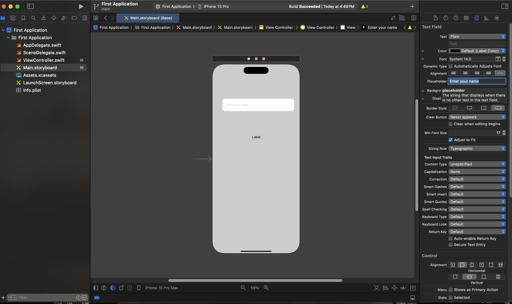

# Step by Step to create your First App

We will see how to make our first project in xcode. Follow the steps shown below.

1. Make a project from xcode.


2. Make sure the project is selected as IOS -> Blank App


3. Give a name and make sure you have the following selection as shown in the image.


> If you dont have an Apple Developer ID, you can type this in your organisation identifier. `com.yourname`, where **yourname** should be replace with your name in this format -> `com.name`
4. Once you create the application you will see the following in the general section.


**What is App Delegate?**

- The App Delegate (AppDelegate.swift file) is a class that acts as the entry point and central coordinator for your iOS app.
- It conforms to the UIApplicationDelegate protocol, which contains methods that get called in response to key events in the app's lifecycle.
Common tasks handled by the App Delegate include app launch, backgrounding, termination, and handling notifications.
- It is responsible for setting up the initial user interface, handling global app state changes, and responding to system events


**What is Scene Delegate?**

- The Scene Delegate (SceneDelegate.swift file) was introduced in iOS 13 to support multiple windows and scenes in an app, allowing better support for multitasking on iPad and enabling apps to work across iOS and macOS.
- The Scene Delegate conforms to the UIWindowSceneDelegate protocol and is responsible for managing the app's windows and scenes.
Each scene represents an instance of the app's user interface and runs independently.
- The Scene Delegate handles setup and configuration for each scene, responding to state changes, and managing the scene's user interface.

**What is Main.storyboard?**

- The Main Storyboard is a visual representation of your app's user interface and the flow between different screens or view controllers.
- It is a canvas in the Interface Builder where you can design and layout the various screens of your app.
- The Main Storyboard is typically named Main.storyboard and is part of your Xcode project.
- It allows you to visually design the user interface by dragging and dropping UI elements onto the canvas and defining connections (segues) between different view controllers.
- The initial view controller, which is the first screen users see when the app launches, is often indicated by an arrow pointing to it.

**What is ViewController.swift?**

- A View Controller is an instance of the UIViewController class in iOS that manages the content and behavior of a specific screen or view in your app.
- View Controllers are responsible for handling user interactions, managing the view hierarchy, and responding to lifecycle events.
- Each screen in your app typically corresponds to a separate view controller.
- View Controllers can be linked together using **segues** *(Will be covered later.)* defined in the Main Storyboard, allowing for smooth navigation between different screens.


1. This is how your Main.storyboard looks like.


> Th Arrow that you see is the starting point in your UI, this is the first page you see when your IOS App loads.

6. Try Adding a Label by clicking the the (+) button as shown below.


7. Once you add the label *(click on the label)* look at the right section of the screen. You will see the attribute pane for the UIElement - label.


- You can change the attributes like the text, font size, font syles, color of the UIElement selected. 

8. Try adding a **TextField** and a **Button**
   1. Make sure you add a placeholder *(look in the attribute pane in the right.)*

    

   2. Change the style of the button from plain to default. Give a name to the button. *(Look in the attribute pane in the right.)*
    

9. Now we will connect the UIElements from the *Main.storyboard* to the *ViewController.swift*, before that we will click on the assistant menu. click on the icon indicated by the black arrow, and click on select. **(Please make sure, that the UIElement or the storyboard is selected before you click on the assistant.)**


10. After you do this, your screen will look like this.


11. Now select the UIELement, then press on the *ctrl* key in the mac keyboard **(Do not press the command key, it will not work.)**, and drag the line to the editor opened on the right hand side.
    1.  If the element is a **Label** or a **TextField**, please the drag the element **ABOVE** the **viewDidLoad()**, and give it a variable name.


    2.  If the element is a **Button**, place the drag the element to the editor, **BELOW** the **viewDidLoad()**, and give it a variable name.


> To know more about why we drag the **Label** and **TextField**, above the **viewDidLoad()** and the button below the **viewDidLoad()**. [Click here](Readme.md#storyboard-terminologies)


12. Once you complete the first 11 steps, we will try to take the name from the user and show it in the **Label**, when the **Button** is pressed.

- But before we proceed, we need to know what is the `viewDidLoad()`
> `viewDidLoad()` is a method in the UIViewController class in iOS development that gets called once the view associated with the view controller has been loaded into memory. It is a part of the view controller's lifecycle and is commonly used to perform setup tasks, configurations, and initializations related to the view.

**Example**

```swift
// Once you finish all the 11 steps, your
// ViewController.swift will look like this.
import UIKit

class ViewController: UIViewController {

  
    @IBOutlet weak var textField: UITextField!
    // you can learn about @IBOutlet in the Readme.md
    @IBOutlet weak var labelText: UILabel!

    override func viewDidLoad() {
        super.viewDidLoad()
       
    }

    // you can learn about @IBAction in the Readme.md
    @IBAction func buttonPressed(_ sender: UIButton) {
    } 
}
```

13.  Refer the code below to complete the step **12**
    
```swift
class ViewController: UIViewController {

  
    @IBOutlet weak var textField: UITextField!
    // you can learn about @IBOutlet in the Readme.md
    @IBOutlet weak var labelText: UILabel!

    override func viewDidLoad() {
        super.viewDidLoad()
       labelText.text = "Hello"
    }

    // you can learn about @IBAction in the Readme.md
    @IBAction func buttonPressed(_ sender: UIButton) {
        labelText.text = textField.text
        print("Button is Pressed")
    } 
}
```

14. Once you finish all the 13 steps, click on the play button on the top left corner, and the app will run for you, in an emulator.

## Things to improve (DIY)

1. Make sure the alignment is proper
2. Give proper spacing, between each elements, make the UI Pretty.
3. When the button is pressed, make sure you handle the null safety in the **ViewController.swift** file.

```swift
@IBAction func buttonPressed(_ sender: UIButton) {
        labelText.text = textField.text
        // the above code doesnt handle the error, if no data is present. you need to fix this.
        print("Button is Pressed")
    } 
```


## UIElements 

A UI (User Interface) element in iOS refers to any visual component or object that a user can interact with on the screen. UI elements are the building blocks of an iOS app's interface, providing a means for users to input data, view information, and interact with the app.

Common UI elements;

1. **UILabel:** Used to display static text.

2. **UITextField:** Allows the user to enter text.

3. **UIButton:** Represents a tappable button that triggers an action.

4. **UISwitch:** A toggle switch that can be in an on or off position.

5. **UIImageView:** Displays images.

6. **UITableView:** Presents a scrollable list of rows, often used for displaying lists of data.

7. **UICollectionView**: A more flexible container for displaying a collection of items in a grid or custom layout.

8. **UITextView:** Allows the user to enter and edit multiline text.

9. **UISlider:** A slider that allows the user to select a value from a range.

10. **UIPickerView:** Displays a spinning wheel or a set of wheels for the user to select from a list of options.

11. **UIStackView:** Arranges other UI elements in a stack, either horizontally or vertically.

12. **UIViewController:** Represents a screen or a component of the app's user interface.
