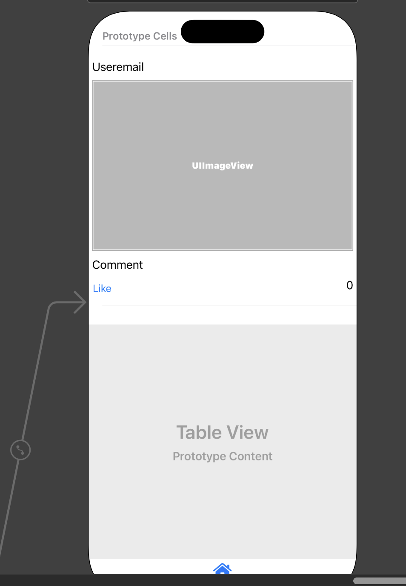
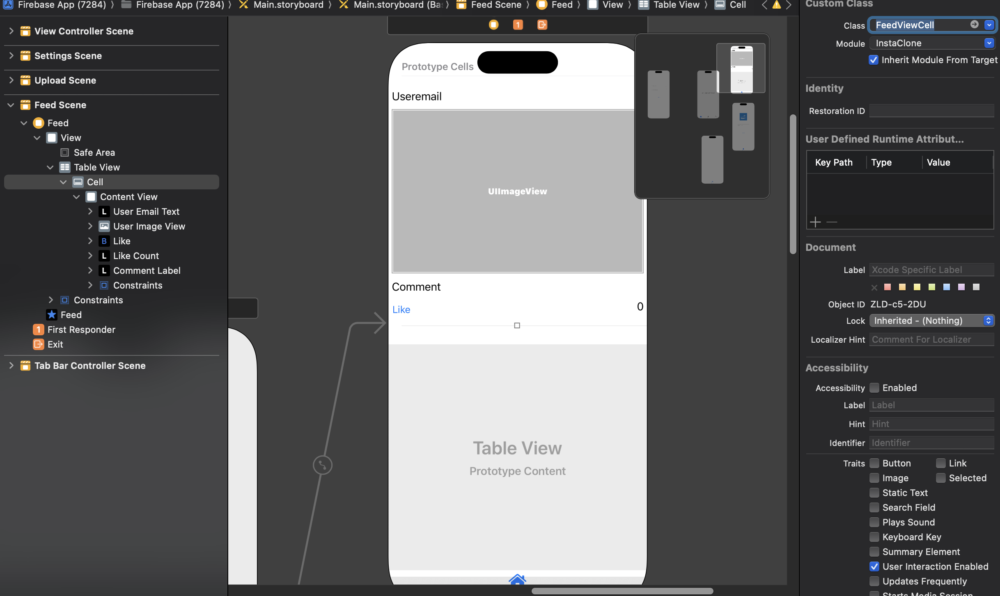
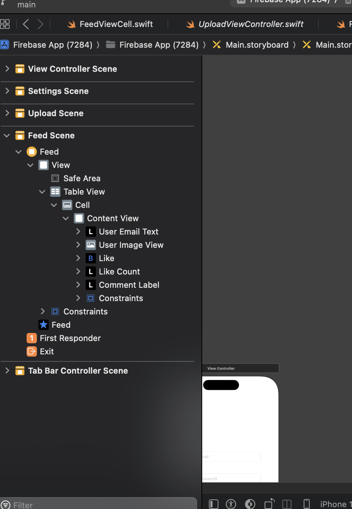

# Get Firebase Data

## Steps 

When we want to fetch the databse from a database such as firebase, we will need to use a UI Element called **TableView** which will contain a **TableViewCell**, where we will display all of the data we get from firebase firestore.

### TableView

It is an UIElement, which loops through the list of data from firebase and shows the data as a list in our app. 


### StoryBoard

> This is the overview of the UI


> Once we create the UI we need to create a **cocoa touch file** to link the **cell** to a **new controller file**. Here is the code for **[FeedViewCell.swift](./GetFirebaseData.md#feedviewcellswift)**




> This is the structure of the **TableView** and the **cell**





### FeedController.swift


```swift
import UIKit
import FirebaseAuth // firebase imports
import FirebaseStorage // firebase imports
import FirebaseFirestore // firebase imports
import SDWebImage // Image library import

// SDWebImage - https://github.com/SDWebImage/SDWebImageSVGKitPlugin.git


class FeedViewController: UIViewController, UITableViewDelegate, UITableViewDataSource { // these are required.

    @IBOutlet weak var tableView: UITableView! // link to storyboard
    
    // Will be used to destructure the information.
    var userEmailArray = [String]()
    var userCommentArray = [String]()
    var likeArray = [Int]()
    var userImageArray = [String]()

        override func viewDidLoad() {
        super.viewDidLoad()
        
        tableView.delegate = self
        tableView.dataSource = self
        getDataFromFirestore() // firebase firestore

        // Do any additional setup after loading the view.
    }
    
    func tableView(_ tableView: UITableView, numberOfRowsInSection section: Int) -> Int {
        tableView.rowHeight = 400 // explicity set the height of the table view cell
        return userEmailArray.count
    }
    
    func tableView(_ tableView: UITableView, cellForRowAt indexPath: IndexPath) -> UITableViewCell {
        let cell = tableView.dequeueReusableCell(withIdentifier: "Cell", for: indexPath) as! FeedViewCell
        cell.userEmailText.text = userEmailArray[indexPath.row]
        cell.userImageView.sd_setImage(with: URL(string: userImageArray[indexPath.row]))
        cell.commentLabel.text = userCommentArray[indexPath.row]
        cell.likeCount?.text = String(likeArray[indexPath.row])
        return cell
    }

        func getDataFromFirestore( ){
        let firestoreDatabase = Firestore.firestore()
        
        firestoreDatabase.collection("Posts").addSnapshotListener( {
            ( snapshot, error) in
            if error != nil {
                print(error?.localizedDescription ?? "Something went Wrong.")
            }else{
                // We have some data in it.
                if  snapshot?.isEmpty != true && snapshot != nil {
                    
                    for document in snapshot!.documents {
                        let documentID = document.documentID
                        print(documentID)
                        
                        if let postedBy =  document.get("postedBy") as? String{
                            self.userEmailArray.append(postedBy)
                        }
                        
                        if let postComment = document.get("comment") as? String {
                            self.userCommentArray.append(postComment)
                        }
                        
                        if let likes = document.get("likes") as? Int {
                            self.likeArray.append(likes)
                        }
                        
                        if let imageurl = document.get("imageUrl") as? String {
                            self.userImageArray.append(imageurl)
                        }
                    }
                    // after the for loop.
                    // reload the table view
                    self.tableView.reloadData() // reload table view.
                }
            }
        })
    }


}


```

### FeedViewCell.swift


```swift
import UIKit

class FeedViewCell: UITableViewCell {
    
    //  Link these to the Cell in Feedview
    @IBOutlet weak var userEmailLabel: UILabel! 
    
    @IBOutlet weak var commentLabel: UILabel!
    
    @IBOutlet weak var userImageView: UIImageView!
    
    @IBOutlet weak var likeCount: UILabel!
    
    override func awakeFromNib() {
        super.awakeFromNib()
        // Initialization code
    }

    override func setSelected(_ selected: Bool, animated: Bool) {
        super.setSelected(selected, animated: animated)

        // Configure the view for the selected state
    }
    
    
    @IBAction func likeButtonPressed(_ sender: UIButton) {
        // we will work on it later.
    }
    
}

```